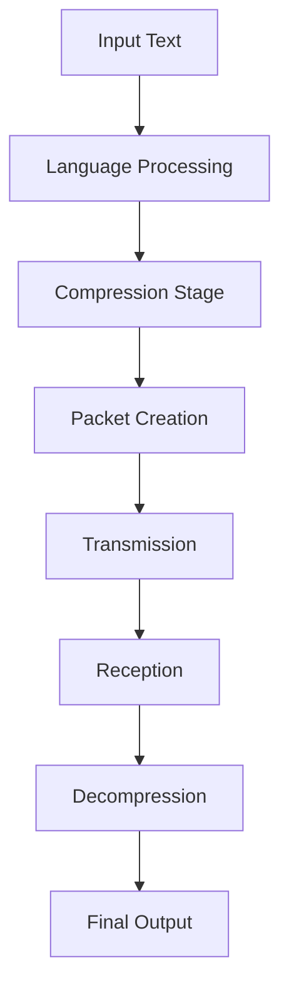

# 📊 Diagrams & Charts

## Comparative Study of Data Sent Over Network in English and Sanskrit

---

## 🧠 1. System Architecture Diagram


---

## 📈 2. Data Size Comparison

```
Data Size (Bytes)

English   ████████████████████████████ 800
Sanskrit  ██████████████████████      650
```

---

## ⚡ 3. Transmission Efficiency Flow



---

## 🧩 4. Conceptual Diagram

```
          +----------------------+
          |  Human Language      |
          +----------------------+
                    |
        +-----------+-----------+
        |                       |
   English                Sanskrit
 (Less Dense)         (More Dense)
        |                       |
  More Data                Less Data
        |                       |
 Slower Transmission    Faster Transmission
        |                       |
   More Bandwidth        Optimized Network
```

---

## 📉 5. Packet Size Comparison

```
Packets Required

English   ██████████ 10
Sanskrit  ███████    7
```

---

## 🚀 6. Efficiency Graph

```
Efficiency ↑

100 |            ● Sanskrit
 80 |
 60 |      ● English
 40 |
    +-------------------------
       Language Type →
```

---

## 🧪 7. Experimental Pipeline


---

## 📌 Conclusion

These diagrams demonstrate that Sanskrit may offer:

* Higher semantic density
* Reduced data size
* Fewer packets required
* Improved transmission efficiency

compared to English in networking systems.

